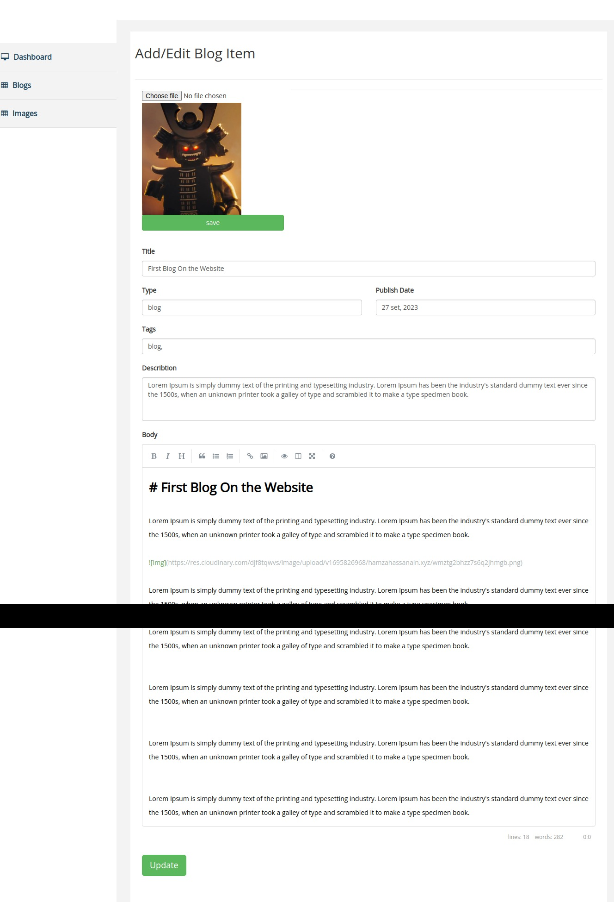

# The Back-end and Admin Panel for the personal-blog

### [Se the front end](https://github.com/Hamzawy00/personal-blog-frontend)

### How is this application made: (very briefly) :

This application is divided into two parts: <strong> The Admin Panel</strong>,<strong> The API</strong>

To run this application you have to get <strong> Node js </strong> installed on the machine and a mongoDB database either on your local computer or hosted somewhare like mongodb atlas or something else.

I also use Cloudinary as a storage for the image I upload form the Admin Panel. You also need a Cloudinary account or you can remove the feature of uploading to Cloudinary and upload to a local folder instead

For the bloging part I use markdown as blogs body and then get it parsed and sanatized and sotred as HTML.

Also for the database I consider everything to be a Blog and then differentiate them as dashboard,link, image and the other custom user defined types

#### The API:

```
/api/v1/blogs/all ---> Gets all blogs of all types (the hole database)

/blogs/single/:slug ---> (Gets a single blog based on the slug) (Note image,dashboard and link do not have a slug)

/blogs/of-type/:type ---> (Gets all blogs of some type)

```

## How to get Started with the application:

First in your terminal

```
git clone https://github.com/Hamzawy00/personal-blog-backend.git

cd personal-blog-backend

npm i
```

Then create a <strong> .env </strong> and past the follwing:

```
DB_URL=https://like-to-mongo-db-database-on-your-local-machine-or-online

CLOUD_NAME=your-cloudinary-cloud-name

API_KEY=your-cloudinary-api-key

API_SECRET=your-cloudinary-api-secret-key

ADMIN_COOKIE_SECRET=cookie-secret-key-for-express-sesstion

ORIGIN_ALLOWED=https://cors-opstions-for-from-where-you-will-call-the-api

ADMIN_NAME=adminpanelusername

ADMIN_PASSWORD=adminpanelpassword

PORT=4000

DEV=TRUE -> To enable the debugger
```

After this make sure you are in the directory of the application and in the termnial run:

```
npm run dev
```

### To remove uploading to cloudinary do the following:

Got to <strong> middlewares/fileUpload.mjs </strong>
Change:

```
const storage = new CloudinaryStorage({
  cloudinary,
  params: {
    folder: "hamzahassanain.xyz",
  },
});

const parser = multer({ storage });
```

To

```
const parser = multer({ dest: 'uploads/' });
```

#### <strong> And Create the uploads directory </strong>

### How the admin looks like



